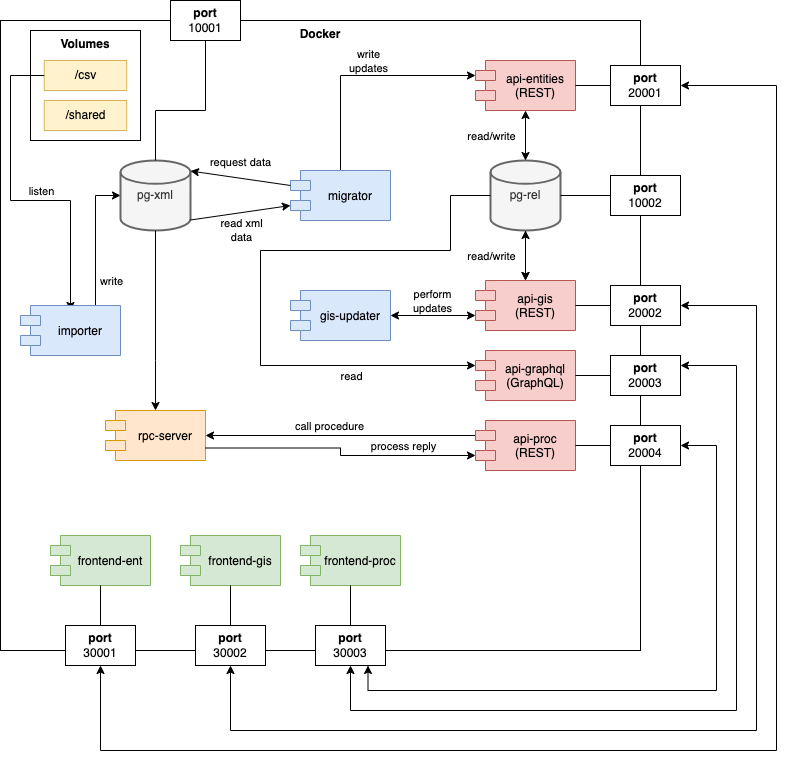

# Systems Integration Development Kit

### Introduction

This environment allows you to easily install the development environment and its dependencies.
This is to be used for the 2nd project in Systems Integration course from Informatics Engineering at IPVC/ESTG.

### How to I setup my development environment?

- Install [Docker Desktop](https://www.docker.com/products/docker-desktop/)
- Create the necessary Docker Images and Containers by running the following command in the project's root folder:

```
docker-compose up --build -d
```

- _Note:_ the **-d** flag intends to launch all the containers in background. If not used, all the containers will run attached to the same process.
- Once your are done working in the assignment, you can remove everything by running:

```
docker-compose down
```

- **NOTE:** once you run the command above, the data in the database will be reset if not stored in a volume. Consider stopping the container instead, if you want to keep the data.

```
# stops all the containers
docker-compose stop

# restarts all the containers
docker-compose start
```

### Docker Images

#### PostgreSQL Database (xml)

- Available at localhost:10001 or db-xml:5432 within docker virtual network
  - **username**: is
  - **password**: is
  - **database**: is

#### PostgreSQL Database (rel)

- Available at localhost:10002 or db-rel:5432 within docker virtual network
- This database also installs PostGIS to allow for dealing with the geographical data
  - **username**: is
  - **password**: is
  - **database**: is

#### Python + node.js

- Python 3.9.15, with pip
- node.js 18 + nodemon (that can be used to easily reload apps)
- You can add additional pre-installed packages to the **_requirements.txt_** file. Remember that if you add any dependency, you will have to rebuild the Docker images again.
- The entrypoint of the container is the bash script named **run.sh**.
- You can easily use this python environment by opening up a terminal with the following command.

```
docker-compose run <name of the container that uses this image> /bin/bash
```

- You can also run directly a Python script as follows.

```
docker-compose run --rm <name of the container that uses this image> python db-access/main.py
```

- Every time you use the command **_docker-compose run_**, a new unnamed container will be created. The **_--rm flag_** will automatically remove the created container once the run is over.
- Please consider that if you use **docker-compose run**, the bash script **run.sh** needs to be run manually in order to execute the application

### Architecture



#### Containers

##### _pg-xml_

Database where the xml and csv converted files are stored.

##### _pg-rel_

Database where the relational data is stored, namely the entities of the system.

##### _importer_

Daemon-type application, which runs in the background. The application must constantly look for new CSV files in the Docker csv volume and start converting to XML and then migrating to the pg-xml database.

##### _migrater_

Daemon-type application, which runs in the background and is started every 5 mins (configurable). The application will check if there are new files in the imported_documents table of the pg-xml and perform the migration of the XML data to the pg-rel database tables, using the api-entities API.

##### _update-gis_

Daemon-type application, which runs in the background and is started every 5 mins (configurable). The application will select up to 100 entities from the pg-rel database for which it is necessary to update or obtain GPS coordinates. As with TP1, the coordinates can be obtained using Nominatim's Search API, with the already existing HTTP Requests module in Python.

##### _api-entities_

Web REST API in Django that allows performing CRUD of all entities.

##### _api-gis_

Web REST API in Django that allows obtaining geographical data by region.

##### _api-proc_

Web REST API in Django that allows for reporting. Obtains the data from the RPC Server.

##### _api-graphql_

Web GraphQL API that allows for reporting. Obtains the data from the Entities API.

##### _frontend-ent_

Web frontend application that allows consulting the entities' data.

##### _frontend-gis_

Web frontend application based in Leaflet that allows consulting the entities in a map.

##### _frontend-proc_

Web frontend application that allows consulting the reports of the system.

##### _rpc-server_

RPC application that does reporting over the XML database.

#### Volumes

##### _csv_

Place where we can drop CSVs to be imported by the system.

##### _shared_

Generic volume that can be used for any purpose, to help out developing the other containers.

---

#### _Informatics Engineering @ipvc/estg, 2022-2023_

###### _Professors: Jorge Ribeiro and Luís Teófilo_
